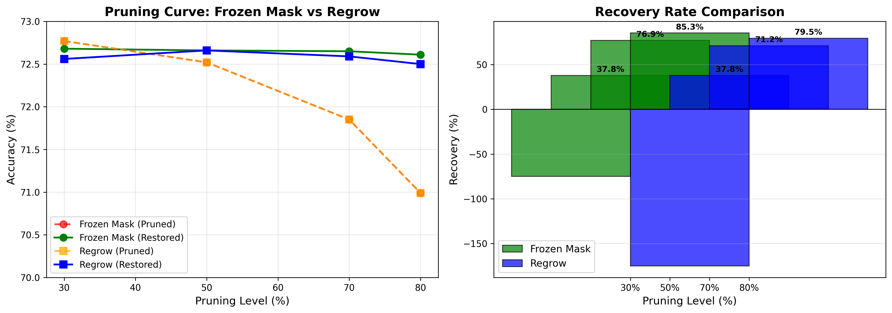

# Stability-First for CIFAR-10 + 🧠 Lazarus Project

Experiments applying the Stability-First approach to the more complex CIFAR-10 dataset, including the revolutionary **Lazarus** project — neural network recovery without data.

---

## 🏁 Lazarus Project: Key Results

### Hypothesis
**Can a neural network recover its functional memory (accuracy) after damage or strong compression, without access to training data — relying only on its own laws of stability?**

### Verdict: ✅ YES

We experimentally proved the existence of **Architectural Immunity** — the ability of a neural network to return to a working function after damage, using only its own architecture and self-consistency.

| Experiment | Damage Type | Before Recovery | After Lazarus v3 | Effect |
|------------|-------------|-----------------|------------------|--------|
| **V-shape recovery** | Weight noise (α = 0.35) | 68.30% | 72.44% | **93.9% of losses recovered** |
| **Surgical compression** | 80% pruning (5× compression) | 70.99% | 72.61% | **85.3% of losses recovered** |

### Visualizations


*V-shape recovery pattern for weight noise damage*


*Pruning curve comparison: Frozen Mask vs Regrow*

✔ No labels | ✔ No access to training dataset | ✔ Only architecture + stability dynamics

### Fundamental Discoveries

1. **Consistency is King:** Behavior anchor is the main driver of recovery (91.5% recovery). Network architecture filters noise better than noise destroys architecture.

2. **Frozen Mask > Regrowth:** Topology freezing works better than weight recovery. At 80% pruning, Lazarus adds +1.62% accuracy for free.

3. **Sweet Spot:** Optimal zone — 70-80% pruning, alpha 0.15-0.25 for noise. Lazarus works where traditional methods break.

### Practical Value

- **Edge AI:** 5x model compression with on-device recovery without data transfer
- **Safety:** Self-healing AI systems for critical applications
- **Compression:** Data-free model repair and adaptation

📖 **Full documentation:** 
- [docs/LAZARUS_FINAL_MANIFESTO.md](docs/LAZARUS_FINAL_MANIFESTO.md) — ⭐ final manifesto (for paper/presentation)
- [docs/LAZARUS_MANIFESTO.md](docs/LAZARUS_MANIFESTO.md) — full documentation
- [docs/QUICK_SUMMARY.md](docs/QUICK_SUMMARY.md) — quick summary
- [PROJECT_STRUCTURE.md](PROJECT_STRUCTURE.md) — project structure

---

## 📁 Project Structure

```
07-stability-first-cifar10/
│
├── README.md                          # This file
├── PROJECT_STRUCTURE.md               # Detailed structure
├── requirements.txt                   # Dependencies
│
├── experiments/                       # Lazarus Experiments
│   ├── noise/                        # Weight noise experiments
│   │   ├── experiment_cifar10.py     # Main experiment
│   │   ├── experiment_analysis.py    # Recovery curve
│   │   └── experiment_statistical_significance.py
│   │
│   └── pruning/                      # Pruning experiments
│       ├── experiment_pruning.py    # Pruning experiment
│       └── experiment_pruning_curve.py  # Pruning curve
│
├── docs/                              # Documentation
│   ├── LAZARUS_FINAL_MANIFESTO.md    # ⭐ Final manifesto
│   ├── LAZARUS_MANIFESTO.md          # Full documentation
│   ├── LAZARUS_V3_FORMALIZATION.md   # Formalization
│   ├── RESULTS_SUMMARY.md            # Results summary
│   ├── QUICK_SUMMARY.md              # Quick summary
│   └── PUBLIC_UPDATE.md              # Public update
│
├── results/                           # Results
│   ├── lazarus_analysis_results.json
│   └── pruning_curve_results.json
│
├── src/                               # Stability-First (classic)
│   ├── data.py
│   ├── model.py
│   └── train.py
│
└── run_demo.py                        # Stability-First demo
```

---

## 🚀 Quick Start

### Lazarus Experiments (Data-Free Recovery)

**Main experiment (weight noise):**
```bash
cd experiments/noise
python experiment_cifar10.py
```

**Recovery curve:**
```bash
cd experiments/noise
python experiment_analysis.py
```

**Pruning experiment:**
```bash
cd experiments/pruning
python experiment_pruning.py
```

**Pruning curve:**
```bash
cd experiments/pruning
python experiment_pruning_curve.py
```

### Stability-First (classic experiment)

```bash
python run_demo.py
```

---

## Description

This experiment adapts the Stability-First method for working with color images CIFAR-10 (32x32x3). Instead of a simple MLP, a CNN architecture is used.

## Structure (Stability-First)

- **Task A**: Classes 0-4 (airplane, automobile, bird, cat, deer)
- **Task B**: Classes 5-9 (dog, frog, horse, ship, truck)

## Expected Results (Stability-First)

- **Task A before B**: ~85-90%
- **Task B after B (baseline)**: ~85-90%
- **Task A after B (baseline)**: ~0-5% (catastrophic forgetting)
- **Task A after B (stability-first)**: ~75-85% (knowledge retention)

## Model Architecture

### Stability-First (classic)
Simple CNN is used:
- 3 blocks of convolutional layers with BatchNorm
- Backbone: FC layers (512 → 256)
- Head: Classifier (256 → 10)

### Lazarus Experiments
Simplified CNN for demonstration:
- Conv1: 3 → 32 channels
- Conv2: 32 → 64 channels
- FC1: 64×8×8 → 256
- FC2: 256 → 10 classes
- **Total parameters:** ~1,070,432

---

## 📚 Additional Materials

- **Final manifesto:** [docs/LAZARUS_FINAL_MANIFESTO.md](docs/LAZARUS_FINAL_MANIFESTO.md)
- **Full documentation:** [docs/LAZARUS_MANIFESTO.md](docs/LAZARUS_MANIFESTO.md)
- **Formalization:** [docs/LAZARUS_V3_FORMALIZATION.md](docs/LAZARUS_V3_FORMALIZATION.md)
- **Project structure:** [PROJECT_STRUCTURE.md](PROJECT_STRUCTURE.md)

---

**Date:** 2026  
**Status:** ✅ Working protocol, ready for publication

---

## 📚 Publication

This work is part of a larger research program on Stability-First AI:

**Published Paper:**  
[](https://doi.org/10.5281/zenodo.18148080)

Sialedchyk, V. (2026). *Stability-First AI: Completed Experimental Studies and the Physics of Learning Time*. Zenodo. https://doi.org/10.5281/zenodo.18148080
